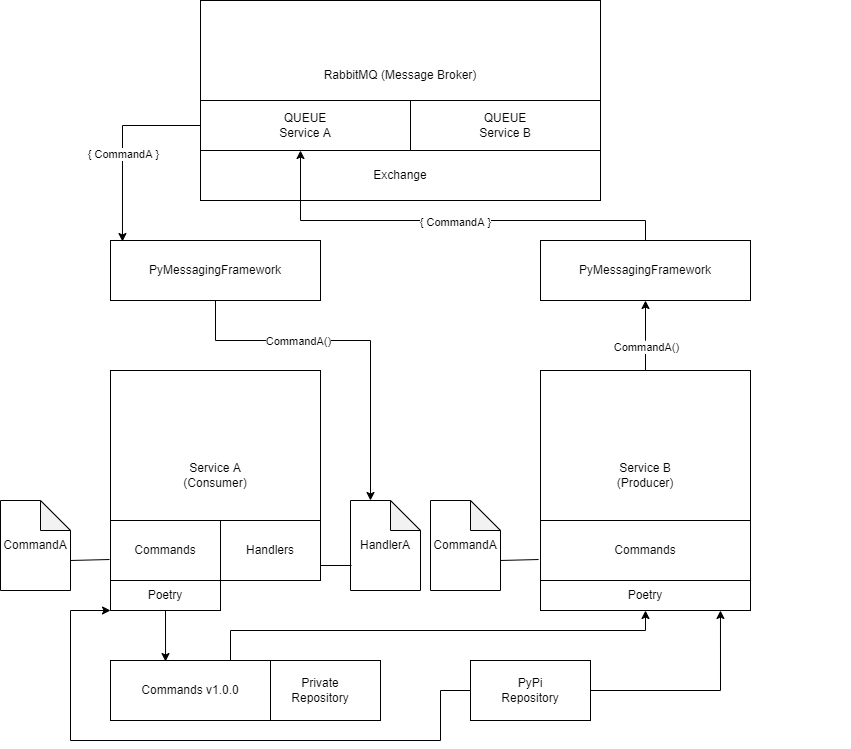

# EmailMe - A Pythonic Microservice Architecture

[Microservice architecture](https://en.wikipedia.org/wiki/Microservices) is one of the software system architectures which is commonly used to build scalable complex systems. I have recently been looking into different ways I can create a scalable microservice architecture with Python. [Django](https://www.djangoproject.com/) is a python based web framework that I have been using for a long time to develop [monolithic](https://en.wikipedia.org/wiki/Monolithic_application) applications. 

With the emergence of technologies like [Docker](https://www.docker.com/), [Kubernetes](https://kubernetes.io/), [message brokers](https://en.wikipedia.org/wiki/Message_broker), etc. it is now feasible, affordable and possible to develop well designed microservice architectures in relatively short amount of time. 

I have been used to developing microservice applications using .Net Framework, especially since it has a large eosystem and community. Technologies like [Azure DevOps](https://azure.microsoft.com/en-us/services/devops/), [Nuget](https://www.nuget.org/), [NServiceBus](https://particular.net/nservicebus) enables us to develop microservices and effectively integrate [CI/CD](https://en.wikipedia.org/wiki/CI/CD) pipeline with it. 

## Sharing codebase

One of the challenges that I faced when developing a microservice application using Python is the management of private and public packages. When developing any application we largely use public packages from the [PyPi](https://pypi.org/) repository. However, when developing a microservice application we need to share certain codebase with multiple applications. Creating private python packages makes the task of sharing codebase easy. Furthermore, when we update the private package it becomes easier to update the version in all the applications using the package.

When developing an application it is easy to install packages with [pip](https://pypi.org/project/pip/) from multiple repositories using the following command:

```
python -m pip install --index-url <repository url> <package name>
```

But when implementing a CI/CD pipeline we normally do not install each package individually. Rather we prefer generating a file like requirements.txt which contains all the packages that needs to be installed. We then use the package manaeger to install all the packages from the generated file. One issue that I faced is, requirements.txt contains just the package name and version. It does not contain the repository url. It is true that we can pass private repository names via '--extra-index-url' parameter. But it contains a security issue. If someone creates a malicious package using the same name as that of our private packages, provide higher version number and upload the package to PyPI, our application will attempt to download the malicious package from the public repository instead of using our private repository for it. 

One approach to solving the problem is to pull all the public packages used in our application to the private repository and then install all packages from private repository thereby, disabling installation from PyPi. But managing all public packages in a private repo, maintaining the packages and adding new packages to the private repo when a developer adds a public package to an application is quite cumbersome.

So, I started looking into different package managers for python that might provide me the ability to manage private and public packages easily and provide me the option to securely pull packages from multiple repositories, especially when pulling the packages automatically in the CI/CD pipeline. Then I came across [Poetry](https://python-poetry.org/) which is a tool for dependency management and packaging in python. It contains a 'pyproject.toml' file and 'poetry.lock' file which helps us install the packages securely.


## Inter-service communication

The other challenge which I faced was integrating the mechanism for communication between the different microservices in our application. There are a lot of ways to achieve this goal. We can use HTTP protocol to communicate with other applications via HTTP requests. In that case, we will need to manually construct the mechanism to securely communicate between the services. Another modern approach is to use a message broker which acts as a communication medium between the services. [RabbitMQ](https://www.rabbitmq.com/) is a state-of-the-art message broker which enables this feature. Moreover, python contains a lot of packages like [Pika](https://pika.readthedocs.io/en/stable/) which helps the integration of RabbitMQ with python applications. However, one of the standard ways to pass messages via message broker is through [JSON](https://www.w3schools.com/js/js_json_intro.asp) objects. There are mainly two types of messages that are passed from one service to another: Commands and Events. Let us take a look at the command based communication:

**Service A** is a [producer](https://www.oreilly.com/library/view/building-event-driven-microservices/9781492057888/ch10.html) which will send a **command** to **Service B** which will act as the [consumer](https://www.oreilly.com/library/view/building-event-driven-microservices/9781492057888/ch10.html). The **command** contains a message and a ID. The message is a string and the ID is an integer.

1. First we will create the command as a JSON object inside **Service A** as follows:

```
{
    "ID": 1,
    "message": "Hello world"
}
```

2. We will then pass the command to a [message queue](https://aws.amazon.com/message-queue/) of the message broker. We will choose the queue to which the consumer is listening.

3. The message broker will then forward the command to **Service B** (consumer).

4. **Service B** will then take the message and call a method which is associated for the command. It will pass the message as input to the method and the method will perform some task.


In the above scenario we have a problem. Suppose we have 50 producers, each of which is a different service and those services can send the same **command** to the consumer. Now suppose at some point in time we want to add a new paramter **author** to the command. To add this new parameter we have to go through all the producer applications, search all the files to seek out where we send the JSON command. Then add the new parameter to all the JSON commands. This process can be quite annoying. We can create a system where all the commands go through a central point but we need to do this for all the services.

What if all our commands resided in the consumer application as independent classes along with the handlers (methods which performs the task when a command is sent to the consumer)? In that case, when we add a new parameter to the handler, we can add the same parameter to the command class. We can share the list of commands availbale for the consumer as a private python package. All other services which needs to communicate with the consumer can install the command package and use the package to create objects from the command classes and then pass the object to the consumer itself. It can make the management of the commands and the handlers very smooth. When we add a new parameter to the command we can simply update the package of all producers and they will then have the updated command class.

[PyMessagingFramework](https://pypi.org/project/PyMessagingFramework/) is a messaging framwork which sits between a service and the message broker. All we need to do is attach command classes to its corresponding handler methods for a consumer and attach command classes to its corresponding message queues for producers. We can then pass the command object from producer to the messageing framework. PyMessagingFramework will then convert the object to appropriate format that the message broker understands. It will then route the message to the appropriate queue. On the other side, inside the consumer - it will receive the message convert it back to the command object and pass the object to its corresponding handler. One advantage with this package is that we can play with python objects instead of JSON objects. On the other hand, PyMessagingFramework decouples the message broker from the services. A service should not care which message broker is being used. If we change the message broker we should not have to update the code structure in our application.

## Architecture

After solving both the above problems, the microservice architecture which I designed is as follows:



We first create the consumer (Service A) and create the command classes in a separate folder called **commands**. We then publish the **commands** package to our private repository. We then connect the consumer to the PyMessagingFramework and connect PyMessagingFramework to the Message Broker.

Next we create the producer (Service B) and install the command package inside the producer via poetry. Then we attach the message queue of consumer (QUEUE Service A) with each command of the command package through PyMessagingFramework. Then we connect PyMessagingFramework to the Message Broker.

We can then easily publish a command from Service B to Service A.


## Task

The microservice application which we will be creating contains two services:

1. WebService: This application is web application developed using Django. Users can send emails through this application. They can provide an email subject, email body and a recipient's email address. When they submit the form, the application will forward this data as a command to the consumer.

2. EmailService: This application is a microservice application developed using PyMessagingFramework. This service receives the email contents from WebService and then prints it out in the console.

We containerized the entire system using docker so that anyone can clone the project and easily start the system using the docker-compose file.

In this tutorial, we will go through the major portion of each important file to see what each section does and how the entire system interacts with each other.

The tutorial contains the following pre-requisites:

1. Python

2. [Docker](https://www.docker.com/)

3. [RabbitMQ](https://www.rabbitmq.com/)

4. [Poetry](https://python-poetry.org/)

5. [Microservice architecture](https://en.wikipedia.org/wiki/Microservices)

6. [Django](https://www.djangoproject.com/)

7. [PyPi](https://pypi.org/)

A basic understanding of these technologies will be very helpful to follow along with me.

I have used the following technologies in the application:

1. [Docker](https://www.docker.com/)

2. [RabbitMQ](https://www.rabbitmq.com/)

3. Private PyPi Server

4. [PyMessagingFramework](https://pypi.org/project/PyMessagingFramework/)

5. [Django](https://www.djangoproject.com/)


**Note: All file paths provided in the following tutorial is relative to the root folder**

## Environment File

**Filepath: ./.env**

The first file we will analyze is the .env file. It contains the following environment variables:

```
MQ_USERNAME=admin
MQ_PASSWORD=admin
PPYPI_USERNAME=admin
PPYPI_PASSWORD=admin
PPYPI_URL=http://privatepypi:8080
EMAILME_EMAILSERVICE_QUEUE=emailme_emailservice
```

This file contains the credentials which we will use for RabbitMQ (MQ_USERNAME and MQ_PASSWORD), the credentials which we will use for our private PyPi repository (PPYPI_USERNAME, PPYPI_PASSWORD), url of our private PyPI repository (PPYPI_URL) and the queue name (EMAILME_EMAILSERVICE_QUEUE) which we will use for our consumer (EmailService) application.

We will pass these variables to our docker-compose file to use for configuration of different applications.

## RabbitMQ - Docker Compose

**Filepath: ./docker-compose.yml**

```
rabbitmq:
    image: rabbitmq:3.10-management
    container_name: emailme_rabbitmq
    ports:
      - 127.0.0.1:5672:5672
      - 127.0.0.1:15672:15672
    
    volumes:
      - ./MQ/data:/var/lib/rabbitmq/docker
      - ./MQ/log:/var/log/rabbitmq/docker

    environment:
      - RABBITMQ_DEFAULT_USER=${MQ_USERNAME}
      - RABBITMQ_DEFAULT_PASS=${MQ_PASSWORD}

    hostname: emailme_rabbitmq
    networks: 
    - emailme_net
    command: bash -c "echo Hello && rabbitmq-plugins enable rabbitmq_management && rabbitmq-server"
```

This section of the docker-compose file contains the configuration for our RabbitMQ application. We will use the RabbitMQ image available on [Docker Hub](https://hub.docker.com/). We will use the port **5672** so that our services can communicate with MQ via this port. We will use the port **15672** so that we can view the MQ management dashboard on our browser. It will help us to see the queues which different services create, the messages passed among different services, etc. We will use the **command** to start the MQ server and MQ management server when the container starts.


## Private PyPi - Docker File

**Filepath: ./PrivatePyPi/Dockerfile**

```
FROM pypiserver/pypiserver:v1.5.0

ARG username
ARG password

RUN apk add apache2-utils

RUN htpasswd -scb /data/.htpasswd $username $password

ENTRYPOINT [ "/entrypoint.sh" ]
```

This is the dockerfile which creates the image for our private PyPi repository server. We will use PyPi image available on [Docker Hub](https://hub.docker.com/). We receive the credentials as argument from the docker-compose file. We install apache-utils to start the server and then store the credentials which clients will be providing to authenticate with the server.

## Private PyPI - Docker Compose

**Filepath: ./docker-compose.yml**

```
privatepypi:
    image: emailme_privatepypi
    container_name: emailme_pypi
    build:
      context: ./PrivatePyPi
      args:
        - username=${PPYPI_USERNAME}
        - password=${PPYPI_PASSWORD}
    ports:
      - 127.0.0.1:8010:8080
    # volumes:
      # - ./PrivatePyPi/packages:/data/packages

    networks:
      - emailme_net

    command: -P /data/.htpasswd -a update,download,list /data/packages
```

This section of the docker-compose file contains the configuration for our private PyPi repository. It uses the port **8080** so that our services can communicate with the repository. We will use the **command** to start the server up and provide the permission to update, download and view packages of the repository if the client provides valid authentication credentials. 

## EmailService - Docker File

**Filepath: ./EmailService/Dockerfile**

```
FROM python:3.7

ARG privatepypiurl
ARG privatepypiusername
ARG privatepypipassword

WORKDIR /usr/src/app

COPY ./emailme.emailservice emailme.emailservice
```
This file creates the image for our EmailService application. We use a base python 3.7 image from Docker Hub. We receive the private PyPi server url and credentials as argument from the docker-compose file. We will need this to create and publish the application as a package to our private PyPi Server. WebService can install the package and use the command class to publish an email via EmailService.

```
RUN apt-get update && apt-get install curl && \
curl -sSL https://raw.githubusercontent.com/python-poetry/poetry/master/get-poetry.py | python3 -

ENV PATH="${PATH}:/root/.poetry/bin" \
POETRY_NO_INTERACTION=1
```

In this section we install Poetry and then configure poetry to use our private PyPi server. We set the bin directory path as environment variable of the container.

```
WORKDIR /usr/src/app/emailme.emailservice

RUN poetry config virtualenvs.create false && \
poetry config repositories.ppypi $privatepypiurl && \
poetry config http-basic.ppypi  $privatepypiusername $privatepypipassword && \
poetry install

CMD [ "./startup.sh" ]

```

In this section we configure Poetry to use our private PyPi repository. We also provide the credentials to our private repository. Then finally we install all the packages of the application which is enlisted in **poetry.lock** and **pyproject.toml** file. We then start the application via the **startup.sh** file.

## EmailService - Startup Script

**Filepath: ./EmailService/emailme.emailservice/startup.sh**

```
#!/bin/bash
echo "sleeping..."
sleep 10
```

This is the file which starts the EmailService application. First it sleeps for 10 seconds so that RabbitMQ can start.

```
echo "Publishing package to private Pypi..."
poetry build
```

Then it creates python package inside dist/ folder. The package contains the entire EmailService codebase for now. But we can only publish the command/ folder as the package if we want. It will keep the package size smaller and remove unneccessary files from the package.

```
poetry publish -r ppypi
echo "Running application"
```

After creating a package, it publishes the package to our private PyPi repository.

```
poetry run python emailme_emailservice/startup.py
```

It then starts the EmailService application to start listening for messages.

## EmailService - Startup Python File

**Filepath: ./EmailService/emailme.emailservice/emailme_emailservice/startup.py**

```
from PyMessagingFramework.framework import MessagingFramework
from emailme_emailservice.commands.email_command import EmailCommand
from emailme_emailservice.handlers.email_handler import EmailHandler

import os
```

We import the PyMessagingFramework to connect to the message broker. We also import **EmailCommand** that contains the command class and **EmailHandler** that contains the handler for the command. We also import the **os** package to retrieve our MQ credentials, urls and queue name from the environment variable which was set by the docker-compose file.

```
MQ_HOST = os.getenv('MQ_HOST', 'rabbitmq')
MQ_PORT = int(os.getenv('MQ_PORT', '5672'))
MQ_USERNAME = os.getenv('MQ_USERNAME', 'guest')
MQ_PASSWORD = os.getenv('MQ_PASSWORD', 'guest')
QUEUE_NAME = os.getenv('EMAILME_EMAILSERVICE_QUEUE', 'emailme_emailservice')
```

We set the MQ url, credentials and the name of the queue which we will create inside message broker to consume messages.

```
framework = MessagingFramework(
        broker_url=MQ_HOST, # URL of rabbiMQ
        broker_port=MQ_PORT, # port of rabbiMQ
        broker_username=MQ_USERNAME, # username of rabbiMQ
        broker_password=MQ_PASSWORD, # password of rabbiMQ
        queue_name=QUEUE_NAME, # Queue name of consumer,
        auto_delete=True, # Whether to auto delete the queue when application is stopped
        non_blocking_connection=False # Creates a non blocking connection
    )
```

We then create the MessagingFramework object. We pass all the required configurations to connect to the broker, create a queue and exchange messages.

```
framework.register_commands_as_consumer(command=EmailCommand, handler=EmailHandler)
```

Here we attach the command with the handler so that if the framework receives this specific command, it calls this specific handler.

```
print("Starting application")
framework.start()
```

It then connects to the message broker and creates required queue for the application if it does not already exist. Then it starts listening for messages.


## EmailService - Command

**Filepath: ./EmailService/emailme.emailservice/emailme_emailservice/commands/email_command.py**

```
from PyMessagingFramework.framework import BaseCommand
from typing import List

class EmailCommand(BaseCommand):

    def __init__(self, body:str, subject:str, recipient:str):
        self.body = body
        self.subject = subject
        self.recipient = recipient
```

This is the command class which contains data which will be passed to the handler when a producer sends an email command to this application. The producer will send an email subject, body and recipient address to the handler. The handler will then process this command using the provided data. This class import PyMessagingFramework's **BaseCommand** class so that the framework recognizes this class as a valid command.

## EmailService - Handler

**Filepath: ./EmailService/emailme.emailservice/emailme_emailservice/handlers/email_handler.py**

```
from PyMessagingFramework.framework import BaseCommandHandler
from emailme_emailservice.commands.email_command import EmailCommand

class EmailHandler(BaseCommandHandler):

    def handle(self, command:EmailCommand):
        print(f"Sending email to {command.recipient}\nSubject:{command.subject}\nBody:{command.body}")
```

This is the handler class which receives the **EmailCommand** command and performs some task. It extends the **BaseCommandHandler** so that PyMessagingFramework recognizes it as a valid handler and so that it can call the **handle** method of this class whenever it receives the corresponding command. **handle** method recieves the command as input and prints out the email contents.

## EmailService - Docker Compose

**Filepath: ./docker-compose.yml**

```
emailservice:
    image: emailme_emailservice
    container_name: emailme_emailservice
    build:
      context: ./EmailService
      # Passed to Dockerfile. Required when creating the image
      args:
        - privatepypiurl=${PPYPI_URL}
        - privatepypiusername=${PPYPI_USERNAME}
        - privatepypipassword=${PPYPI_PASSWORD}
    networks:
      - emailme_net
    # Environment variables passed to the container
    environment:
      - MQ_HOST=rabbitmq
      - MQ_PORT=5672
      - MQ_USERNAME=${MQ_USERNAME}
      - MQ_PASSWORD=${MQ_PASSWORD}
      - PPYPI_USERNAME=${PPYPI_USERNAME}
      - PPYPI_PASSWORD=${PPYPI_PASSWORD}
      - PPYPI_URL=${PPYPI_URL}
      - EMAILME_EMAILSERVICE_QUEUE=${EMAILME_EMAILSERVICE_QUEUE}

    volumes:
      - ./EmailService/emailme.emailservice:/usr/src/app/emailme.emailservice

    command: ./startup.sh
    # Starts after the message broker and private PyPi server starts
    depends_on:
      - rabbitmq
      - privatepypi 
```

This section contains the configuration for the EmailService container. It passes the private PyPi url and credewntials to the dockerfile so that it can integrate the private repo with Poetry. It then passes the MQ credentials and private PyPi credentials along with EmailService queue name to the container so that the application can connect to message broker, publish the codebase as a private package and consume messages from the message broker.

## WebService - Docker File

**Filepath: ./WebService/Dockerfile**

```
FROM python:3.7

ARG privatepypiurl
ARG privatepypiusername
ARG privatepypipassword

WORKDIR /usr/src/app

COPY ./emailme.webservice emailme.webservice

RUN apt-get update && apt-get install curl && \
curl -sSL https://raw.githubusercontent.com/python-poetry/poetry/master/get-poetry.py | python3 -

ENV PATH="${PATH}:/root/.poetry/bin" \
POETRY_NO_INTERACTION=1

WORKDIR /usr/src/app/emailme.webservice

RUN poetry config virtualenvs.create false && \
poetry config repositories.ppypi $privatepypiurl && \
poetry config http-basic.ppypi  $privatepypiusername $privatepypipassword && \
poetry install

RUN poetry run python emailme_webservice/manage.py makemigrations && \
poetry run python emailme_webservice/manage.py migrate

CMD [ "./startup.sh" ]
```

This file creates the image for hosting the web application that will receive the email contents as input from users and forward it to the email service. We use a base Python 3.7 image from Docker Hub.

```
ARG privatepypiurl
ARG privatepypiusername
ARG privatepypipassword
```

We receive the private PyPi  server credentials and urls as input so that we can configure the private repository in Poetry. This will enable us to install the private packages.


```
RUN apt-get update && apt-get install curl && \
curl -sSL https://raw.githubusercontent.com/python-poetry/poetry/master/get-poetry.py | python3 -

ENV PATH="${PATH}:/root/.poetry/bin" \
POETRY_NO_INTERACTION=1
```

We then install Poetry and configure the environment variable to set the path to Poetry executable file.

```
RUN poetry config virtualenvs.create false && \
poetry config repositories.ppypi $privatepypiurl && \
poetry config http-basic.ppypi  $privatepypiusername $privatepypipassword && \
poetry install
```

We then configure the private PyPi repository inside Poetry and then install the packages from pyproject.toml file.

```
RUN poetry run python emailme_webservice/manage.py makemigrations && \
poetry run python emailme_webservice/manage.py migrate

CMD [ "./startup.sh" ]
```

Next we make migration of the Django DB models and start the web application.

## WebService - Startup Script

**Filename: ./WebService/emalme.webservice/startup.sh**

This is the script which is executed to start the Django application

## WebService - pyproject.toml

**Filename: ./WebService/emailme.webservice/pyproject.toml**

```
[tool.poetry]
name = "emailme.webservice"
version = "0.1.0"
description = ""
authors = ["zuhairmhtb <zuhairmhtb@gmail.com>"]

[tool.poetry.dependencies]
python = "^3.7"
Django = "3.2"
PyMessagingFramework = "^1.1.0"
"emailme.emailservice" = {version = "^0.1.0", source = "ppypi"}

[tool.poetry.dev-dependencies]
pytest = "^5.2"

[build-system]
requires = ["poetry-core>=1.0.0"]
build-backend = "poetry.core.masonry.api"

[[tool.poetry.source]]
name = "ppypi"
url = "http://127.0.0.1:8010/simple"

```

This is the Poetry configuration file. It contains the package information and more importantly the private and public packages which we will use for the application.

```
"emailme.emailservice" = {version = "^0.1.0", source = "ppypi"}
```
This is the private EmailService package which we will use to pass the command from WebService to EmailService. You will notice that it contains a 'source' parameter which points it to our private PyPi server. Therefore, whenever we install this package, it will try to fetch the package from the private repository instead of public PyPi server.

## WebService - Poetry Lock

**Filename: ./WebService/emailme.webservice/poetry.lock**

This file contains all information related to the package which we will use in our web application. It also contains SHA hash for packages to maintan package inegrity.

## WebService - Settings.py
**Filename: ./WebService/emailme.webservice/emailme_webservice/emailme_webservice/settings.py**

This is the Django settings file that we will be using for our application. 

```
SECRET_KEY = os.getenv('SECRET_KEY', 'django-insecure-h#5^qx!q^2co5y3+feo_djfa+glarj=08=dq#5wg628ox6yyyw')
MQ_HOST = os.getenv('MQ_HOST', 'rabbitmq')
MQ_PORT = int(os.getenv('MQ_PORT', '5672'))
MQ_USERNAME = os.getenv('MQ_USERNAME', 'guest')
MQ_PASSWORD = os.getenv('MQ_PASSWORD', 'guest')
```

It imports the RabbitMQ (Message Broker) configuration in order to initilize the PyMessagingFramework object and pass command to our EmailService via the message broker.

```
QUEUE_NAME = os.getenv("EMAILME_EMAILSERVICE_QUEUE", "")

framework = MessagingFramework(
        broker_url=MQ_HOST, # URL of rabbiMQ
        broker_port=MQ_PORT, # port of rabbiMQ
        broker_username=MQ_USERNAME, # username of rabbiMQ
        broker_password=MQ_PASSWORD, # password of rabbiMQ
        queue_name="emailme_webservice", # Queue name of producer
        auto_delete=True,  # Whether to auto delete the queue when application is stopped
        non_blocking_connection=False
    )

framework.register_commands_as_producer(command=EmailCommand, routing_key=QUEUE_NAME, exchange_name='')
```

Here we receive our EmailService queue name from the environment variable. We then create a Framework object and register the EmailService command with the queue name. This enables the PyMessagingFramework object to route our command data to the queue whenever we pass the command object to the Framework.

## WebService - Views

**Filename: ./WebService/emailme.webservice/emailme_webservice/emailme_webservice/views.py**

```
import os
from django.shortcuts import render, redirect
from emailme_emailservice.commands.email_command import EmailCommand

from .forms import EmailForm
from .settings import framework

def home(request):
    form = EmailForm()
    message = ""
    if request.method == "POST":
        form = EmailForm(request.POST)
        if form.is_valid():
            print("Sending data to email service")
            framework.publish_message(EmailCommand(
                body=form.cleaned_data["body"], 
                subject=form.cleaned_data["subject"], 
                recipient=form.cleaned_data["recipient"]
                ))
            message = f"You have successfully sent an email to {form.cleaned_data['recipient']}"
            form = EmailForm()
        
    return render(request, 'emailme_webservice/index.html', {
        'form': form,
        'title': 'Home',
        'message': message
    })
```

This is the view for the homepage of our application. Here we create a form to receive the subject, body and recipient address of the email which we will be displaying on our EmailService.

```
framework.publish_message(EmailCommand(
  body=form.cleaned_data["body"], 
  subject=form.cleaned_data["subject"], 
  recipient=form.cleaned_data["recipient"]
))
```
When a user provides these information we create an EmailCommand object with the data and pass the command to PyMessaingFramework. The Framework then routes the message to the configured queue which finally reaches our EmailService handler that handles this command.

## Conclusion

This is our simple microservice application that receives Email input from user and forwards the email to EmailService. The EmailService then prints the email in console. When using docker you might not be able to see the console outputs. In that case, you can bash into the EmailService container, run startup.sh to start another instance of the service. Now when you send emails, the output will be received by each service in a round robin fashion. So, you will be able to see the console output in the service which you started with bash.

I know there are a lot of better approaches to building microservice architectures with python. This is just a simple architecture I have implemented to see how can develop scalable services and manage public and private packages securely inside the service.

I would love to hear from you if you have other architectures in mind and your feedback regarding the archiecture which I have implemented in this tutorial. It is always fun to learn new stuff, implement them and watch the magic happen.

I hope you enjoyed reading this article as much as I have enjoyed making it. Happy coding!